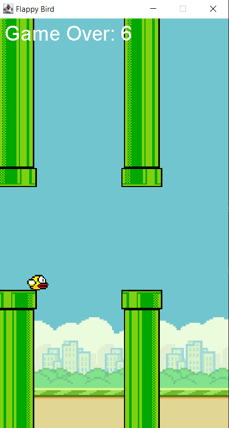

# Flappy Bird in Java 🎮🐦

A simple **Flappy Bird** clone built using **Java Swing**! This project recreates the popular game where the player controls a bird that must navigate through pipes without hitting them.

## 📌 Features
- 🎮 **Smooth gameplay** using Java Swing timers  
- 🖼️ **Custom graphics** for the bird, pipes, and background  
- 🏆 **Score tracking** to keep track of player progress  
- 🔄 **Restart function** when the player loses  

## 🛠️ Technologies Used
- **Java** (Core)
- **Swing & AWT** (For GUI)
- **JPanel, Timer, KeyListener** (For game logic)

---

## 🚀 Getting Started

### 1️⃣ Prerequisites  
Ensure you have Java installed. You can check this by running:  
```sh
java -version
javac -version
```

If Java is not installed, download the **JDK** from:  
🔗 [Oracle JDK](https://www.oracle.com/java/technologies/javase-downloads.html) or [OpenJDK](https://openjdk.org/)

---

### 2️⃣ Clone the Repository  
```sh
git clone https://github.com/your-username/flappy-bird-java.git
cd flappy-bird-java
```

---

### 3️⃣ Compile and Run  
Use the following commands to compile and run the game:  
```sh
javac App.java
java App
```

---

## 📸 Screenshots  
  

---

## 🎮 How to Play  
1️⃣ **Press `SPACE`** to make the bird jump.  
2️⃣ **Avoid hitting the pipes** by carefully timing your jumps.  
3️⃣ **Survive as long as possible** and aim for a high score!  
4️⃣ **Game Over?** Press `SPACE` to restart.  

---

## 📂 Project Structure  
```
📛 flappy-bird-java
 ├📂 img                   # Images for background, bird, pipes
 ├📝 App.java              # Main entry point
 ├📝 FlappyBird.java       # Core game logic
 ├📝 README.md             # Project documentation
```

---

## 🤝 Contributing  
Feel free to fork this repo and submit pull requests with improvements! 🚀  

---

### ⭐ If you like this project, consider giving it a star!  
```
⭐ Star this repo on GitHub to support the development!
```
```

👉 **Next Steps:**  
- Add a **score leaderboard**  
- Improve **collision detection**  
- Enhance **animations and UI effects**  

